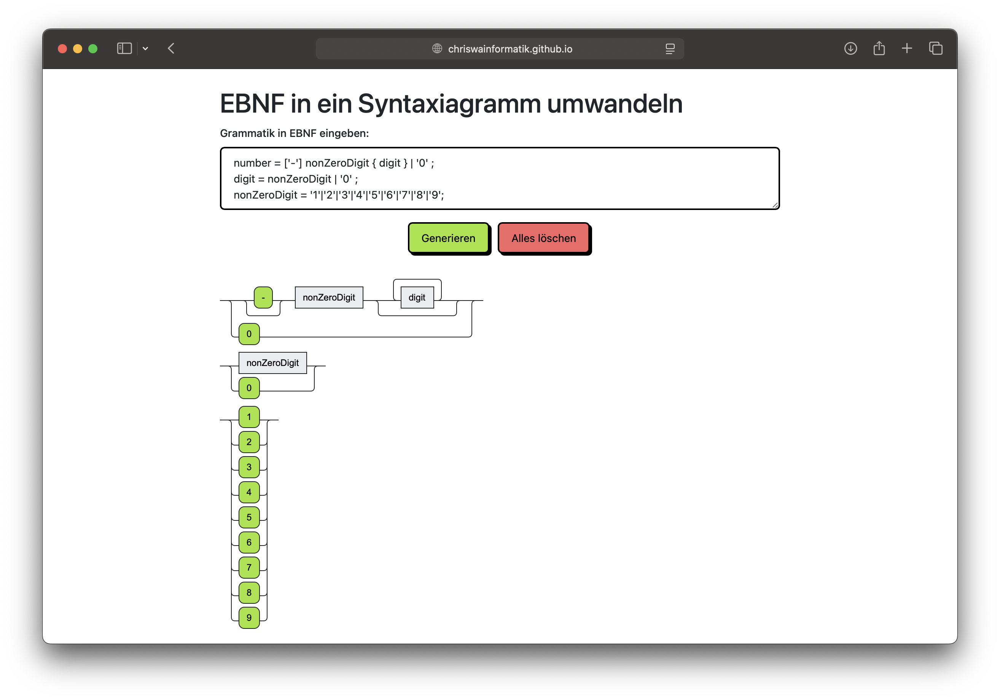

# EBNF2SyntaxDiagram

Web application that transforms grammar rules of a context-free language in [EBNF](https://en.wikipedia.org/wiki/Extended_Backus%E2%80%93Naur_form) into a [syntax diagram](https://en.wikipedia.org/wiki/Syntax_diagram) (also called railroad diagram).

Diagram generation is made by [rrdiagram-js](https://github.com/Chrriis/rrdiagram-js).

[Try it online](https://chriswainformatik.github.io/EBNF2SyntaxDiagram-js).

